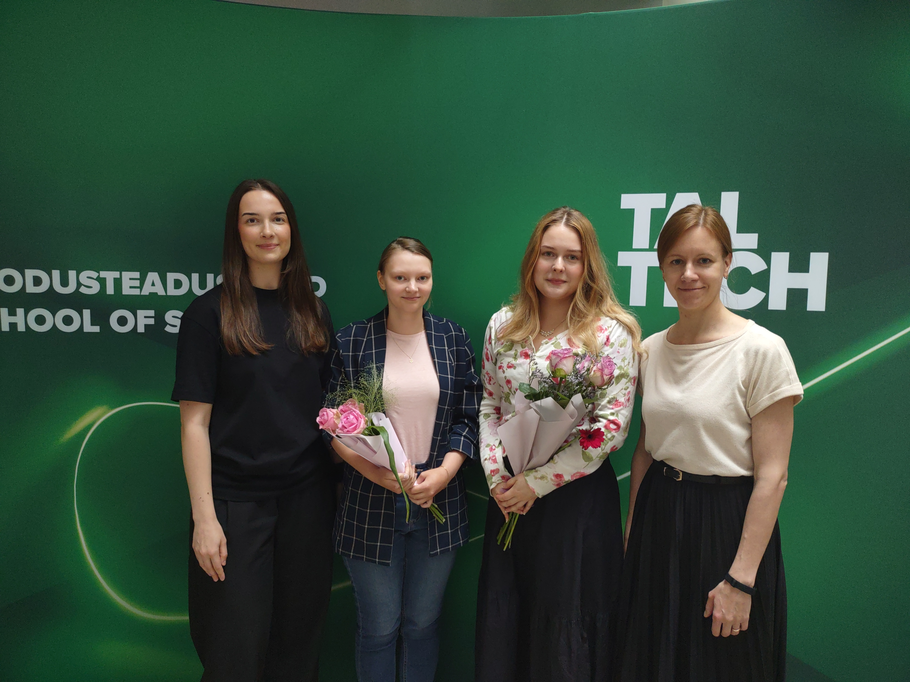

::: {}

2026-06-15\
<b>Congrats to our new BSc graduates!</b>  
  

Sarah and Liisi successfully defended their Bachelor's theses last week! Congratulations on this important milestone, and we wish you continued success in your future studies and careers.
:::
| 
| 
  
::: {}
2026-05-07\
<b>First preprint from the lab!</b>  
Delighted to share that our first preprint by Irma Laas et al. is now available on *bioRxiv*: Long-term maintenance of H3K27me3 in postmitotic neurons is dispensable for gene expression regulation. [https://doi.org/10.64898/2026.05.05.722847](doi.org/10.64898/2026.05.05.722847) 
:::
