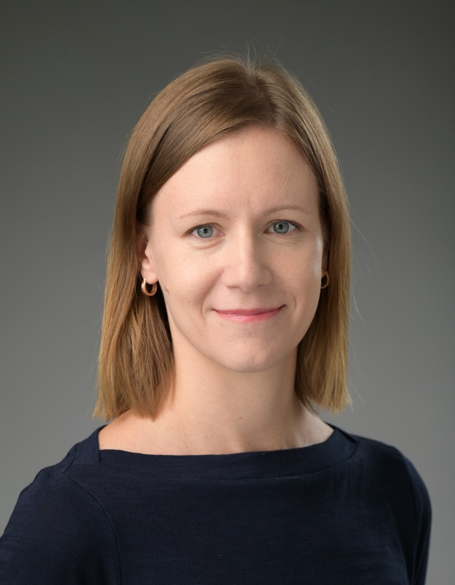
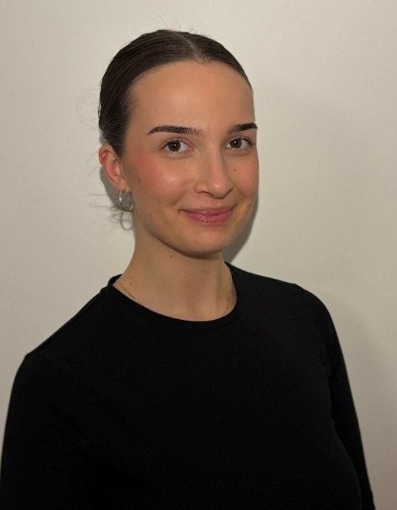
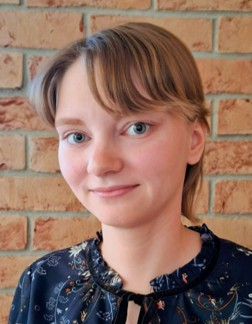
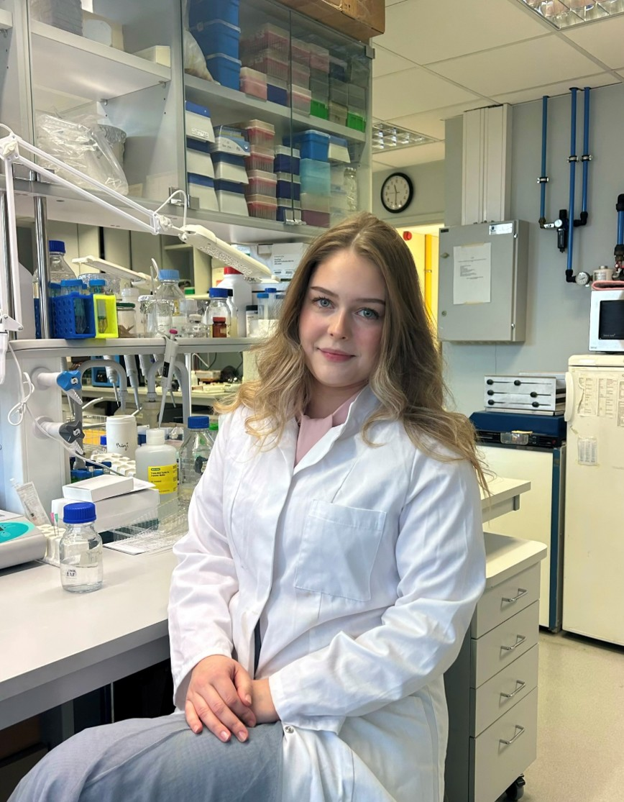

::: {layout="[[32,70]]"}
{fig-align="left" width="240"}  

### Kärt Mätlik, Ph.D.  
<b>Group Leader</b>  
Kärt received her Ph.D. in Physiology and Neuroscience from the University of Helsinki, where she studied the role of neurotrophic factor regulation in midbrain dopamine system function under the mentorship of Jaan-Olle Andressoo and Mart Saarma. For her postdoctoral training, Kärt joined the Laboratory of Developmental Neurobiology at Rockefeller University, led by Mary E. Hatten, where she investigated how chromatin modifications control cerebellar development. Kärt now runs the Neuroepigenetics research group at the Tallinn University of Technology, where she studies the intersection of epigenetics, gene expression and brain development.  

:::

::: {layout="[[32,70]]"}
{fig-align="left" width="240"}  

### Irma Laas, M.Sc.  
<b>PhD Student</b>  
Irma holds a Master's Degree in Biotechnology from Lund University, where she investigated the role of mitochondria-related genes in cancer incidence. She has now joined the Neuroepigenetics research group in TalTech to study chromatin bivalency and the mechanisms and functions of H3K27 trimethylation in developing and mature neurons, with the broader aim of understanding how epigenetic regulation influences neuronal identity and function. Outside the lab, Irma spends her time in pottery classes or practicing folk dance.

:::

::: {layout="[[32,70]]"}
{fig-align="left" width="240"}  

### Liisi Mets  
<b>BSc Student</b>  
Liisi is a Bachelor's degree student in Gene Technology. For her thesis, she studies the function of EZH1 mutations in mouse primary neurons. Of her goals in science, she says: "Some people pursue science to uncover the unknown, while others use existing knowledge to heal, protect and improve life. I aspire to do both."  

:::

::: {layout="[[32,70]]"}
{fig-align="left" width="240"}  

### Sarah-Elisabeth Soitu  
<b>BSc Student</b>  
My thesis focuses on the <i>subnuclear organisation of bivalent domains in human pluripotent stem cells (hPSCs) and hPSC-derived neurons</i>. I’ve always been fascinated by neuroscience, and the complexity of the brain. When I first learned about stem cells, I was really intrigued by them, so I was happy to get the opportunity to work with them and contribute to research in this exciting area. Neuroepigenetics research group perfectly combines these interests and allows me to explore the importance of epigenetic mechanisms in brain development. Outside the lab, I love painting and listening to science and creativity podcasts. For me, science and art are deeply connected, and both inspire the way I see the world!  

:::

Interested in joining the lab? See the Contact tab for more information.

